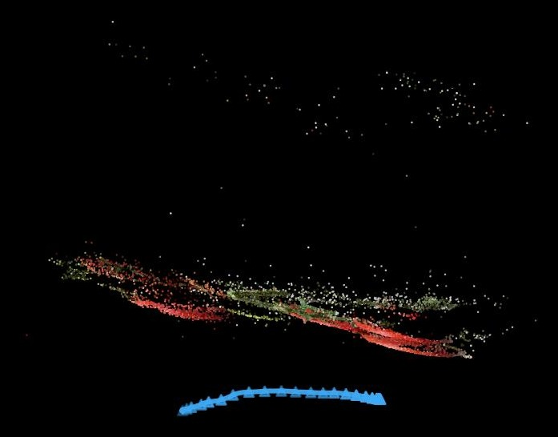
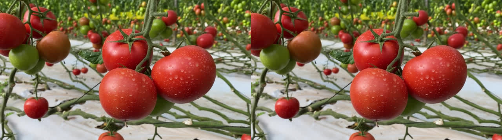
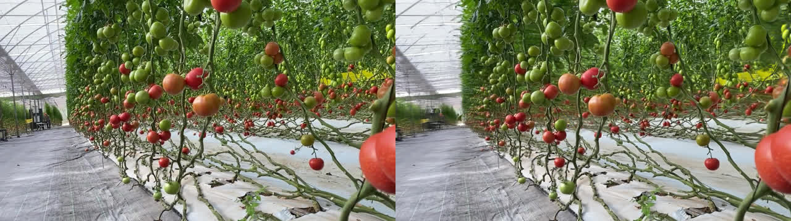
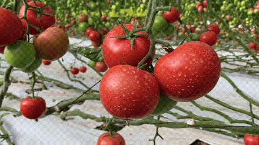
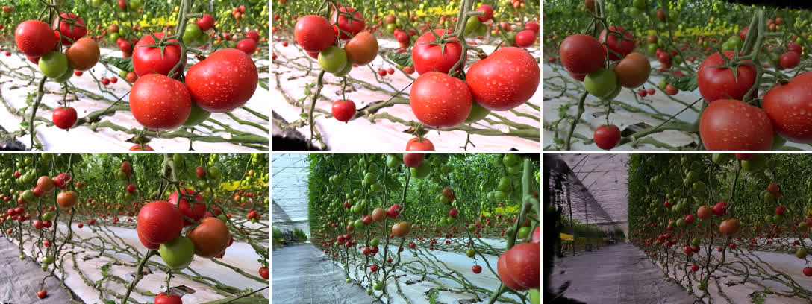
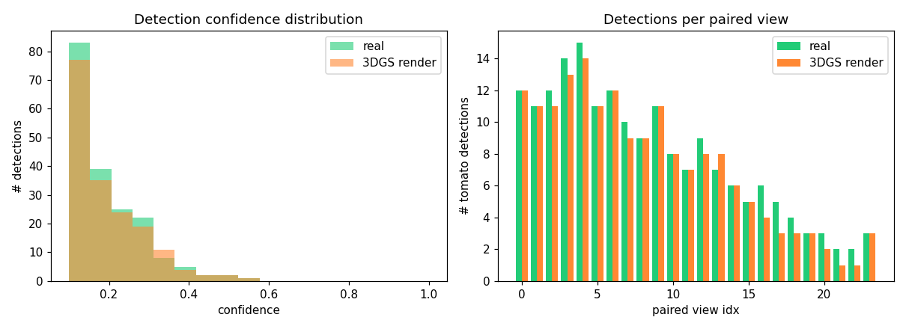
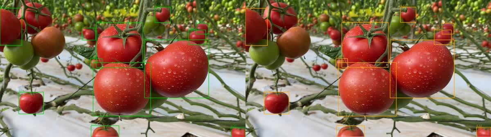

# Field2Scene

실외 환경을 3D Gaussian Splatting으로 재구성하고, 그 씬에서 합성 데이터를 생성해 Sim-to-Real 갭을 검증하고, ROS2 심 카메라로 퍼블리시하는 Real2Sim 파이프라인.

```
촬영/공개 영상 → COLMAP → 3DGS 학습 → 주행 시점 렌더(합성 데이터)
→ YOLO 렌더 vs 실촬영 갭 리포트 → ROS2 sensor_msgs 퍼블리시 → (선택) 메시 추출·Gazebo
```

**현황:** ✅ P1 씬 재구성 · ✅ P2 합성 데이터 생성 · ✅ P3 Sim-to-Real 갭 리포트 · ⬜ P4 ROS2 브리지(로드맵) · ⬜ P5 에셋 최적화(선택)

세 단계 모두 이 저장소의 스크립트·리포트·에셋으로 재현 가능하다(대용량 학습 산출물은 제외 — 아래 재현 참고).

## P1 — 씬 재구성 (완료)

상업용 **토마토 온실** 씬을 3DGS로 재구성했다. 소스는 Pexels 공개 영상 "Tomato farm in greenhouse" (by Mehdi Alaoui, [Pexels License](https://www.pexels.com/license/), [영상 링크](https://www.pexels.com/video/tomato-farm-in-greenhouse-10179855/)) — 직접 촬영이 아니며 출처를 밝힌다.

| 항목 | 값 |
|---|---|
| COLMAP 등록 | 190 / 217 프레임 (sequential matching) |
| 3DGS | 1.33M splat, 30k iter, RTX 4060 Laptop 8GB |
| **held-out(test) PSNR** | **30.73 dB** (train 31.08 — 과적합 아님) |

COLMAP으로 복원한 스파스 포인트클라우드(온실 통로 작물 열)와 카메라 궤적(190장 dolly 경로, 파란색) — 3DGS 학습 전 단계의 중간 산출물.



좌: 원본 프레임(GT) / 우: 3DGS 렌더(학습에 쓰지 않은 held-out 뷰).




정직 노트: 근·중경은 원본과 거의 구별되지 않으나, 관측이 적은 **통로 안쪽 원거리는 흐릿하게** 재현된다(아래 P3에서 검출 손실로 정량화). 재현 절차·파라미터는 [references/p1_result.md](references/p1_result.md) 참조.

## P2 — 합성 데이터 생성 (완료)

학습된 씬에서 **로봇 주행 시점 카메라 경로**를 만들어 novel-view 프레임 **350장**을 렌더했다. 학습 카메라(통로 dolly 궤적)를 SLERP로 재보간해 주행 경로로 쓰고, 도메인 랜덤화(시점 흔들기 + 조도/화이트밸런스/감마)로 Sim-to-Real 비교용 데이터셋을 구성한다. 재학습·재구성 없이 렌더만 — 스크립트 [scripts/render_driving_path.py](scripts/render_driving_path.py), 상세 [references/p2_result.md](references/p2_result.md).

| 패스 | 프레임 | 내용 |
|---|---|---|
| nominal | 150 | 변형 없는 주행 경로 (기준) |
| domain_random | 200 | 시점 ±(횡0.03·높이0.02·yaw7°·pitch3.5°) + 조도×[0.7,1.3]·감마·WB |

프레임별 pose·변형 파라미터를 metadata.json에 기록(seed 고정 → 완전 재현).



도메인 랜덤화 다양성 (시점·조도·위치):



## P3 — Sim-to-Real 갭 리포트 (완료)

**동일 카메라 pose**의 실촬영 프레임 vs 3DGS 렌더(test held-out 24뷰)에 같은 오픈보캡 검출기(YOLO-World, `"tomato"` 프롬프트)를 돌려 검출기 반응의 도메인 갭을 정량화했다. 스크립트 [scripts/gap_report.py](scripts/gap_report.py), 상세 [references/p3_result.md](references/p3_result.md).

| 지표 (24쌍, conf≥0.10) | 실촬영 | 3DGS 렌더 |
|---|---|---|
| 프레임당 검출 수 | 7.79 | 7.29 (×0.94) |
| 평균 신뢰도 | 0.196 | 0.195 |
| IoU≥0.5 매칭 | recall 0.909 · precision 0.971 | |

**갭이 작다** — 3DGS 렌더는 YOLO 검출 관점에서 실사와 거의 동등하며, 남은 6% 검출 손실은 대부분 **원거리 작은 토마토**(P1의 원거리 blur 한계가 downstream으로 이어짐). 라벨 정확도가 아니라 검출기 반응의 상대 갭임을 명시한다.



좌: 실촬영(초록) / 우: 3DGS 렌더(주황) — 같은 토마토가 같은 위치에 검출됨.



## 저장소 구조

```
field2scene/
├── scripts/
│   ├── render_driving_path.py   # P2 주행 경로 novel-view 렌더 + 도메인 랜덤화
│   └── gap_report.py            # P3 실촬 vs 렌더 YOLO 검출 갭 분석
├── references/                  # 단계별 방법·결과·재현 절차 (p1~p3)
├── report/gap_tomato/           # P3 갭 수치 (summary.json · per_frame.csv)
└── assets/                      # 비교 이미지 · 데모 GIF · 갭 차트
```

대용량 산출물(원본 영상, COLMAP·3DGS 학습물, 렌더 데이터셋 350장)은 저장소에 포함하지 않는다(`.gitignore`) — 각 단계 문서의 절차로 재현한다.

## 재현 / 의존성

- **3DGS 학습·렌더**: [INRIA gaussian-splatting](https://github.com/graphdeco-inria/gaussian-splatting) (연구·비상업 라이선스) + COLMAP. RTX 4060 Laptop 8GB에서 검증.
- **검출**: [Ultralytics](https://github.com/ultralytics/ultralytics) YOLO-World (오픈보캡, `"tomato"` 프롬프트).
- 단계별 정확한 명령·파라미터는 `references/p{1,2,3}_result.md` 참조.
- 막혔던 지점과 원인·해결(COLMAP 등록 붕괴, 8GB 학습 속도, 렌더 CUDA 오류 등)은 [references/lessons.md](references/lessons.md) — 엔지니어링 로그.

## 로드맵

- **P4 ROS2 브리지** — 렌더 프레임을 `sensor_msgs/Image` + `CameraInfo`로 퍼블리시하는 심 카메라 노드.
- **P5 에셋 최적화 (선택)** — 스플랫 경량화(현재 1.33M splat) 또는 메시 추출 → Gazebo 로드.
